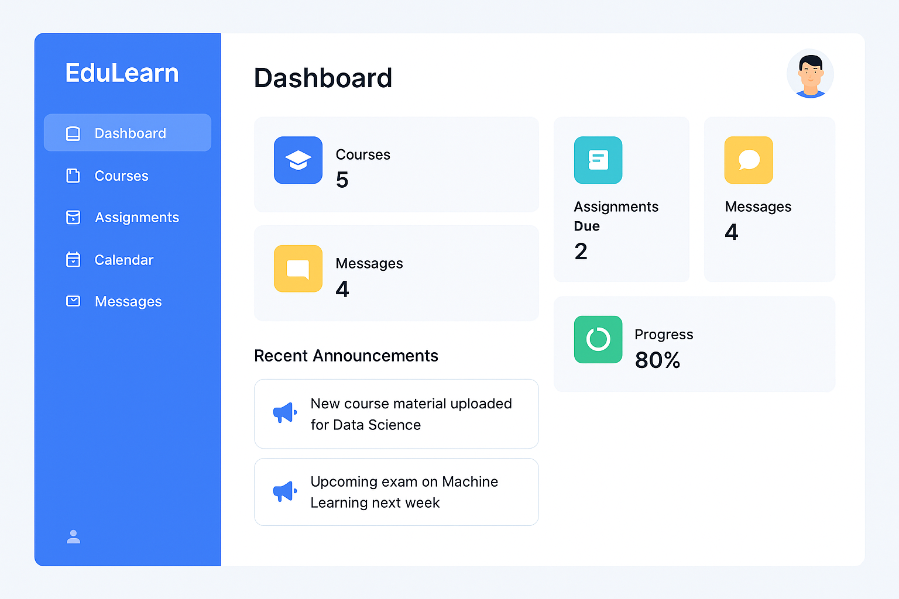
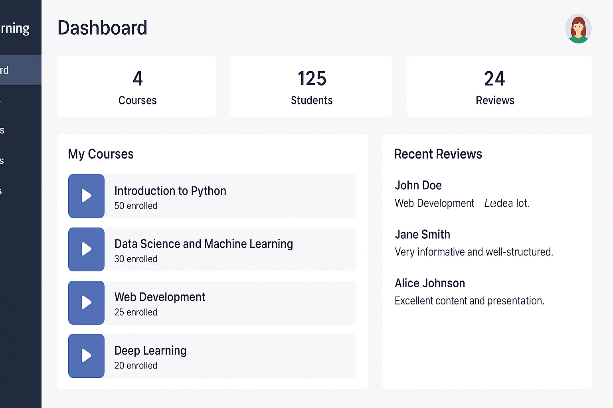

# 🎓 EduLearn – Modern E-Learning Dashboard

EduLearn is a responsive, role-based web dashboard designed for educational platforms. It offers tailored interfaces for both students and instructors, with a clean UI built using modern web technologies.

---

## 📸 Dashboard Previews

### 🧑‍🎓 Student Dashboard  

### 👨‍🏫 Instructor Dashboard  

---

## ✨ Key Features

- 🔥 Clean, modern UI with TailwindCSS
- 📊 Dashboard metrics (courses, assignments, messages, etc.)
- 🧭 Sidebar navigation for seamless UX
- 📢 Announcements and recent activity feed
- 📱 Fully responsive design for desktop and mobile devices
- 🧑‍🏫 Separate views for students and instructors

---

## 🧰 Tech Stack

- **HTML5**
- **TailwindCSS** (CDN integration)
- **Vanilla JavaScript** (optional extensions)
- No backend dependency — easy to deploy on any static host

---

## 📂 Project Structure

edulearn-main/
├── public/
│   └── index.html
├── src/
│   ├── pages/
│   │   ├── dashboard.html
│   │   ├── classes.html
│   │   └── ...
│   ├── styles/
│   │   └── globals.css
│   └── scripts/
│       └── script.js
├── assets/
│   └── (images, fonts, etc.)
├── tailwind.config.ts
├── postcss.config.mjs
├── styles.css
└── README.md

---

---

## 🚀 Getting Started

1. Clone the repository or download the ZIP.
2. Open any `.html` file (e.g., `dashboard.html`) in your browser.
3. Navigate through the dashboard and explore the features.

---

## 🙋‍♂️ About the Developer

**Tamutswa Matondo**  
Frontend Developer & AI Enthusiast  
📧 tamutswamatondo04@gmail.com  
🌐 [GitHub – @Tamutswa](https://github.com/Tamutswa)

---

## 📄 License

Licensed under the [MIT License](LICENSE).
